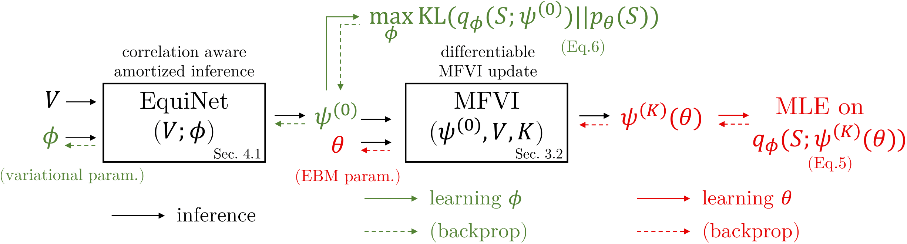

# :fire:EquiVSet:fire:

This repo contains PyTorch implementation of the paper "[Learning Set Functions Under the Optimal Subset Oracle via Equivariant Variational Inference](https://arxiv.org/abs/2203.01693)". [[project page](https://subsetselection.github.io/EquiVSet/)]

> We propose a way to learn set functions when the optimal subsets are given from an optimal subset oracle. This setting is different to other works that learn set functions from the function value oracle that provide utility values for each specific subset. Thus this setting is arguably more practically important but is surprisingly overlooked by previous works. To learn set functions under the optimal subset oracle, we propose to cast the problem into maximum likelihood estimation by replacing the utility function with an energy-based model such that it is proportional to the utility value, and satisfies some desiderata for set functions (e.g., permutation invariance, etc). Then mean-field variational inference and its amortized variants are proposed to learn EBMs on the sets. We evaluate our approach in a wide range of applications, including product recommendation, set anomaly detection, and compound selection in AI-aided drug discovery. The empirical results show our approach is promising.


<p align="center">(Overview of the training and inference processes of EquiVSet.)</p>

## Installation

Please ensure that:

- Python >= 3.6
- PyTorch >= 1.8.0
- dgl >= 0.7.0

The following pakages are needed if you want to run the `compound selection` experiments:

- **rdkit**: We recommend installing it with `conda install -c rdkit rdkit==2018.09.3`. For other installation recipes, see the [official documentation](https://www.rdkit.org/docs/Install.html).
- **dgllife**: We recommend installing it with `pip install dgllife`. More information is available in the [official documentation](https://lifesci.dgl.ai/install/index.html).
- **tdc**: We recommend installing it with `pip install PyTDC`. See the [official documentation](https://tdc.readthedocs.io/en/main/install.html) for more information.

We provide step-by-step installation commands as follows:

```
conda create -n EquiVSet python=3.7
source activate EquiVSet
pip install torch==1.9.0+cu111 torchvision==0.10.0+cu111 torchaudio==0.9.0 -f https://download.pytorch.org/whl/torch_stable.html
pip install dgl-cu110 dglgo -f https://data.dgl.ai/wheels/repo.html

# The following commands are used for compound selection:
conda install -c rdkit rdkit==2018.09.3
pip install dgllife
pip install PyTDC
```

## Datasets
For the experiments, we use the following datasets:

- [Amazon baby registry dataset](https://www.kaggle.com/datasets/roopalik/amazon-baby-dataset) for the `product recommendation` experiments. The dataset is available [here](https://drive.google.com/file/d/1OLbCOTsRyowxw3_AzhxJPVB8VAgjt2Y6/view?usp=sharing).
- [CelebA dataset](https://mmlab.ie.cuhk.edu.hk/projects/CelebA.html) fot the `set anomaly detection` experiments. The images are available [here](https://drive.google.com/file/d/0B7EVK8r0v71pZjFTYXZWM3FlRnM/view?usp=sharing&resourcekey=0-dYn9z10tMJOBAkviAcfdyQ) and the attribute labels are available [here](https://drive.google.com/file/d/0B7EVK8r0v71pblRyaVFSWGxPY0U/view?usp=sharing&resourcekey=0-YW2qIuRcWHy_1C2VaRGL3Q).
- [PDBBind](http://www.pdbbind.org.cn/) and [BindingDB](https://www.bindingdb.org/bind/index.jsp) for the `compubd selection` experiments. The PDBBind dataset is available [here](http://www.pdbbind.org.cn/index.php?newsid=20#news_section) and the BindingDB dataset is available [here](https://www.bindingdb.org/bind/index.jsp).

For all experiments, the dataset is automatically downloaded and preprocessed when you run the corresponding code. You could also download the dataset manually using the link provided.

## Experiments

This repository implements the synthetic experiments (appendix F.1), product recommendation (section 6), set anomaly detection (section 6), and compound selection (section 6).

### Synthetic Experiments

To run on the Two-Moons and Gaussian-Mixture dataset
```
python main.py equivset --train --cuda --data_name <dataset_name>
```
`dataset_name` is chosen in ['moons', 'gaussian'].
We also provide the Jupyter notebook [](https://colab.research.google.com/drive/1_EI0BUjFzNAVxWS1ao-xia_UVmW4KLi4?usp=sharing) to run the synthetic experiments.


### Product Recommendation

To run on the Amazon baby registry dataset
```
python main.py equivset --train --cuda --data_name amazon --amazon_cat <category_name>
```
`category_name` is chosen in ['toys', 'furniture', 'gear', 'carseats', 'bath', 'health', 'diaper', 'bedding', 'safety', 'feeding', 'apparel', 'media'].

### Set Anomaly Detection

To run on the CelebA dataset
```
python main.py equivset --train --cuda --data_name celeba
```

### Compound Selection

To run on the PDBBind and BindingDB dataset
```
python main.py equivset --train --cuda --data_name <dataset_name>
```
`dataset_name` is chosen in ['pdbbind', 'bindingdb'].

## Citation

:smile:If you find this repo is useful, please consider to cite our paper:
```
@article{ou2022learning,
  title={Learning Set Functions Under the Optimal Subset Oracle via Equivariant Variational Inference},
  author={Ou, Zijing and Xu, Tingyang and Su, Qinliang and Li, Yingzhen and Zhao, Peilin and Bian, Yatao},
  journal={arXiv preprint arXiv:2203.01693},
  year={2022}
}
```